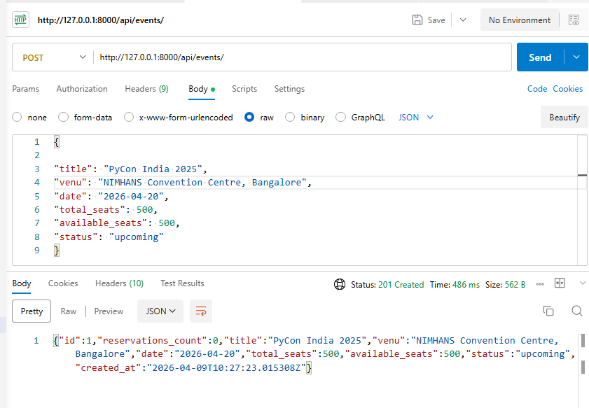
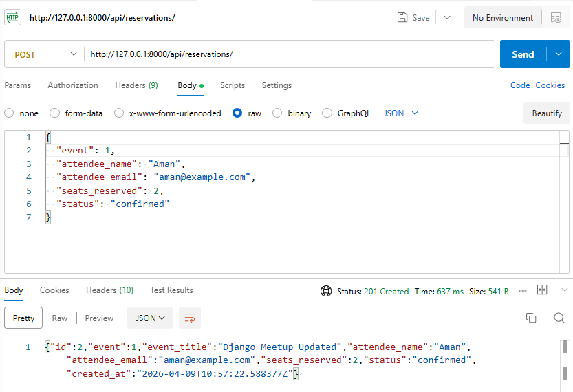
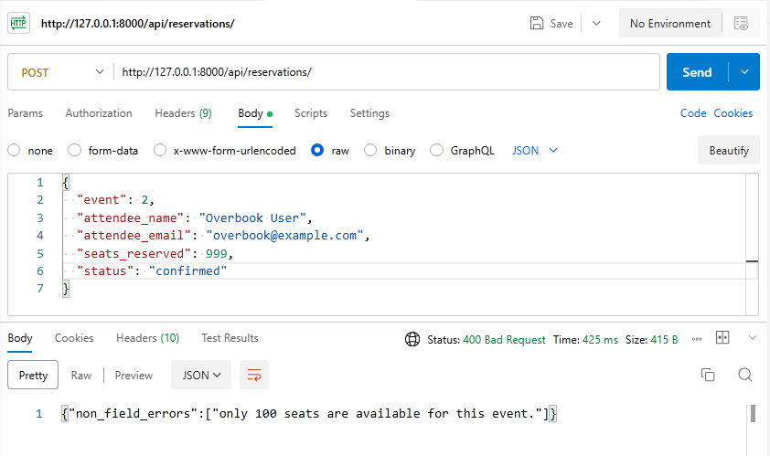
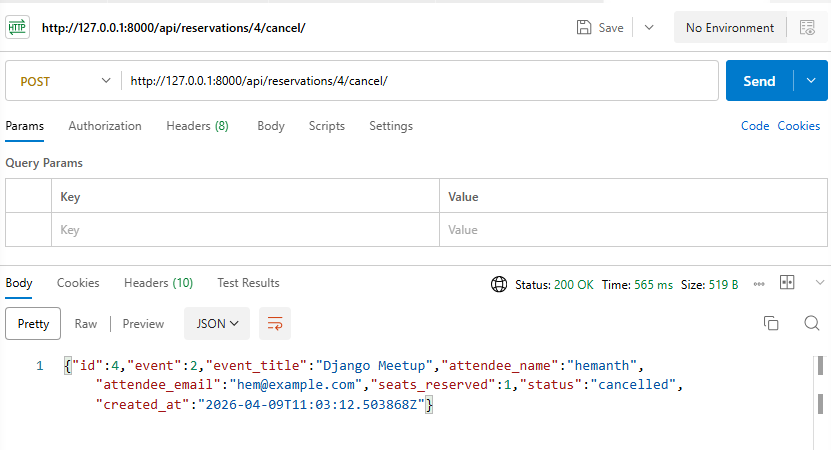

# EventHub API

A Django REST API for managing events and reservations.

## How To Run The Project

### Prerequisites
- Python 3.10+
- pip

### Steps
1. Open terminal in the EventHub folder:

```bash
cd EventHub
```

2. (Optional but recommended) Create a virtual environment:

```bash
python -m venv .venv
```

3. Activate the virtual environment:

Windows (PowerShell):

```powershell
.\.venv\Scripts\Activate.ps1
```

Windows (CMD):

```cmd
.\.venv\Scripts\activate.bat
```

4. Install dependencies:

```bash
pip install -r requirements.txt
```

5. Apply migrations:

```bash
python manage.py migrate
```

6. Run the server:

```bash
python manage.py runserver
```

7. API base URL:

```text
http://127.0.0.1:8000/api/
```

## Endpoints And What They Do

### Event endpoints

| Method | Path | What it does |
|---|---|---|
| GET | /api/events/ | List all events |
| POST | /api/events/ | Create a new event |
| GET | /api/events/{id}/ | Get one event by id |
| PUT | /api/events/{id}/ | Fully update an event |
| PATCH | /api/events/{id}/ | Partially update an event |
| DELETE | /api/events/{id}/ | Delete an event |
| GET | /api/events/?status=upcoming | Filter events by status |
| GET | /api/events/?venue=mumbai | Filter events by venue substring |

### Reservation endpoints

| Method | Path | What it does |
|---|---|---|
| GET | /api/reservations/ | List all reservations |
| POST | /api/reservations/ | Create a reservation and reduce event available seats |
| GET | /api/reservations/{id}/ | Get one reservation by id |
| PUT | /api/reservations/{id}/ | Fully update a reservation |
| PATCH | /api/reservations/{id}/ | Partially update a reservation |
| DELETE | /api/reservations/{id}/ | Hard delete reservation |
| GET | /api/reservations/?event_id=1 | Filter reservations by event id |
| POST | /api/reservations/{id}/cancel/ | Cancel reservation and release seats back to the event |

## Important Validations

### Event validation
- `available_seats` must not exceed `total_seats`.

### Reservation validations
- `seats_reserved` must be greater than 0.
- Reservation is allowed only when event status is `upcoming` or `ongoing`.
- Requested seats must not exceed current `available_seats`.

## Important Screenshots

### Event creation successful


### Successful reservation


### Overbooking failure


### Successful cancellation


## One Design Decision And Why

I used an atomic transaction with row-level locking in reservation creation (`transaction.atomic()` + `select_for_update()`) so two users reserving at the same time cannot oversell seats.

Why this matters:
- Without locking, concurrent requests can both pass validation using stale seat counts.
- With locking, seat updates are serialized and data stays consistent.
